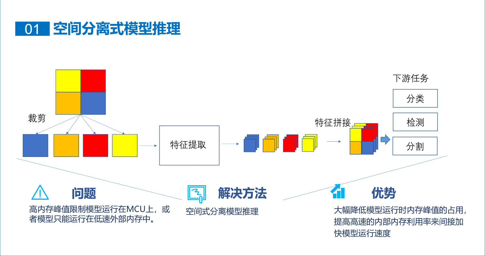
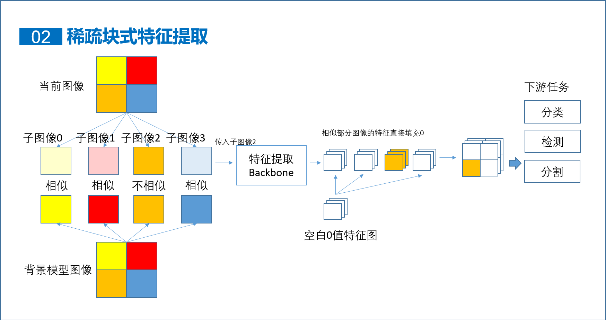

# 基于GD32的AI模型库

<div align="center">

[中文](README.md) | [English](README_eng.md)

</div>


这是一个主要以微控制器GD32为硬件平台的AI模型库。这里提供可以在GD32上使用的各种AI模型，目前有图像分类，目标检测模型。这个模型库有如下特点：

 - 开箱即用，深度适配keil5工程，可以将模型直接部署进keil5工程中，无需复杂的配置keil5工程即可使用部署的模型,支持ARMCC和GCC。提供了可快速上手的工程样例[gd32ai-modelzoo](https://huggingface.co/HomiKetalys/gd32ai-modelzoo/tree/main) 。
 - 完全免费的推理框架TinyEngine，运行速度在F4和H7系列上处与业内前沿，支持GCC和ARMCC(AC6)。
 - 模型运行时的内存占用峰值可调，内存占用峰值远低于同类模型库。
 - 稀疏块式推理，静态场景下可以自动根据目标稀疏性减少推理时间，目标检测模型推理时间低于同类模型库。
 - 提供了训练脚本，模型可重新训练，同时提供了预训练模型，可以通过迁移学习以适应不同应用。

# 主要特点

## 空间分离式模型推理

空间分离式模型的推理设计可以极大降低模型运行时占用的内存的峰值，在资源紧缺的微控制器上，这点极为有用。在各模型的配置文件中，通过配置整数参数`separation`来控制是否使用分离式模型推理，该参数为0时则不使用，为1(2,3)时则在第1(2,3)次下采样后结束分离。参数`separation_scale`控制分离尺度，一般为2的幂，为2时则会将输入图像分成2x2个子图像。



## 稀疏块式推理
稀疏块式推理能够根据目标在图像中的稀疏性，减少特征提取时间，从而减少模型整体的推理时间。在ai_model.h中宏定义ENABLE_SPARSE_PATCH来启用它。



# 可用的模型
以下模型均已导出并生成了对应的C语言代码，同时提供了对应Keil工程样例，详情可见[gd32ai-modelzoo](https://huggingface.co/HomiKetalys/gd32ai-modelzoo/tree/main) 。


 - [目标检测](object_detection):
   - [Yolo-FastestV2](object_detection/yolo_fastestv2):
     - 支持的数据集
       - COCO2017 Dataset
       - Fusion of Abnormal Behavior Driving Dataset
     - 支持的设备
       - GD32F470I
       - GD32H759I
     - 支持的推理框架
       - X-CUBE-AI
       - TinyEngine
   - [YoloV10](object_detection/yolov10)
     - 支持的数据集
       - COCO2017 Dataset
     - 支持的设备
       - GD32F470I
       - GD32H759I
     - 支持的推理框架
       - X-CUBE-AI
       - TinyEngine
 - [图像分类](image_classification):
   - [FastVit](image_classification/ml-fastvit):
     - 支持的数据集
       - Food-101 Dataset
     - 支持的设备
       - GD32H759I
     - 支持的推理框架
       - X-CUBE-AI


#  环境准备

在可用模型中点击你需要使用的模型，然后根据README中的步骤完成环境准备。建议python版本为3.10。除了各模型的环境准备，此处需要注意以下几点：
1. [onnx2tflite](https://github.com/MPolaris/onnx2tflite) 中的tensorflow版本建议为2.13.0。目前它不支持>=2.16.0。
2. 部分包的参考版本如下：
```
pip install torch==2.1.2 torchvision==0.16.2 torchaudio==2.1.2 --index-url https://download.pytorch.org/whl/cu121
pip install opencv==4.6.0
pip install tensorflow==2.13.0
pip install matplotlib==3.9.1
pip install onnx==1.16.1
pip install onnxsim==0.4.36
pip install onnxruntime==1.18.1
pip install timm==1.0.7
pip install torchsummary==1.5.1
pip install pycocotools==2.0.8
pip install psutil==6.0.0
pip install pandas==2.2.2
pip install thop==0.1.1.post2209072238
```


# 引用
 - [onnx2tflite](https://github.com/MPolaris/onnx2tflite)
 - [Yolo-FastestV2](https://github.com/dog-qiuqiu/Yolo-FastestV2)
 - [facelandmarks](https://github.com/midasklr/facelandmarks)
 - [stm32ai-modelzoo](https://github.com/STMicroelectronics/stm32ai-modelzoo/tree/main)
 - [fastvit](https://github.com/apple/ml-fastvit)
 - [yolov10](https://github.com/THU-MIG/yolov10)
 - [FastestDet](https://github.com/dog-qiuqiu/FastestDet) 

# 免责声明

**请仔细阅读并理解本免责声明中规定的所有权利和限制**

GD32AI ModelZoo（以下简称“软件”）由HomiKetalys开发（联系方式：homiketalys@gmail.com）该软件主要以研究超轻量级深度学习模型的部署为主要目的，在GD32上仅进行测试。以下是本软件中规定的所有权利和限制：

1.本软件严禁用于任何侵权、侵犯他人利益、违法或其他不当行为。软件及其作者不承担由此产生的任何直接或间接责任。

2.本软件的功能实现依赖于各种第三方软件。对于因未遵守第三方软件提供的权利和限制而导致的任何侵权、侵犯他人利益、违法或其他不当行为，本软件及其作者不承担由此产生的任何直接或间接责任。
