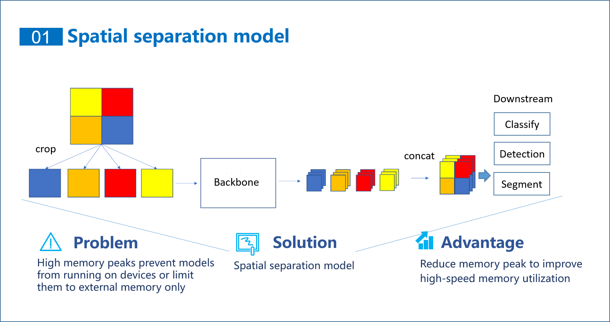

# Welcome to GD32 Model Zoo

Here will provide some deep learning models that can be deployed on GD32 devices。These models have been optimized for GD32 and can run on GD32 devices with fewer memory requirements.This project has the following characteristics。

 - The peak memory usage of the model is adjustable
 - The provided model can be retrained
# Main features: Spatial separation model

# Available models

 - [Object Detection](https://github.com/HomiKetalys/gd32ai-modelzoo/tree/main/object_detection):
   - [Yolo-FastestV2](https://github.com/HomiKetalys/gd32ai-modelzoo/tree/main/object_detection/yolo_fastestv2):
     - Now provide models trained on the following dataset
       - COCO2017 Dataset
       - Fusion of Abnormal Behavior Driving Dataset
     - Now available for deployment on the following devices
       - GD32F470IIH6
       - GD32H759IMK6
 - [Image Classification](https://github.com/HomiKetalys/gd32ai-modelzoo/tree/main/image_classification):
   - [FastVit](https://github.com/HomiKetalys/gd32ai-modelzoo/tree/main/image_classification/ml-fastvit):
     - Now provide models trained on the following dataset
       - Food-101 Dataset
     - Now available for deployment on the following devices
       - GD32H759IMK6
 
# reference
 - [onnx2tflite](https://github.com/MPolaris/onnx2tflite)
 - [Yolo-FastestV2](https://github.com/dog-qiuqiu/Yolo-FastestV2)
 - [facelandmarks](https://github.com/midasklr/facelandmarks)
 - [stm32ai-modelzoo](https://github.com/STMicroelectronics/stm32ai-modelzoo/tree/main)
