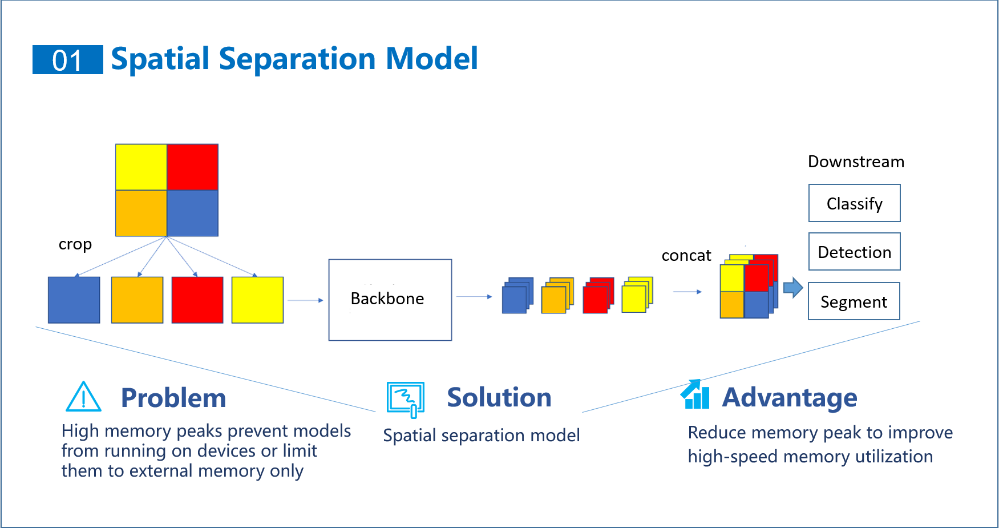
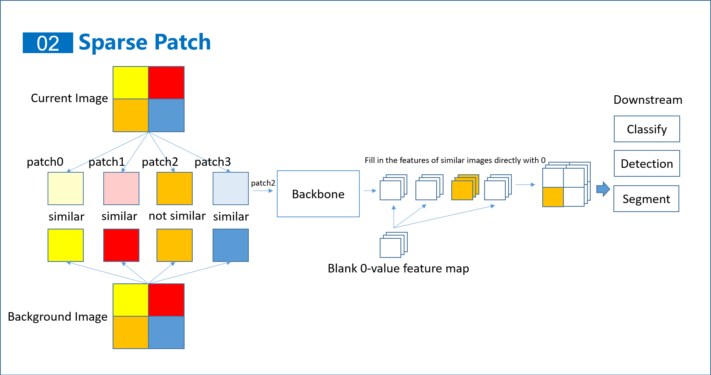

# Welcome to GD32 Model Zoo

This is an AI model library primarily based on the microcontroller GD32 as the hardware platform. Here are various AI models that can be used on GD32, including image classification and object detection models. This model library has the following characteristics:

 - Ready to use out of the box, deeply adapted to Keil5 projects, models can be directly deployed into Keil5 projects, and No need to configure Keil5 to use the model, supporting ARMCC and GCC.
 - The peak memory usage during model runtime is adjustable, and the peak memory usage is lower than that of similar model libraries.
 - Sparse patch inference can reduce inference time based on target sparsity in static scenes, and the inference time of object detection models is lower than that of similar model libraries.
 - Provide training scripts that allow the model to be retrained, as well as pretrained models that can be adapted to different applications through transfer learning.

# Main features
## Spatial separation model

The inference design of spatially separated models can greatly reduce the peak memory consumption during model operation, which is extremely useful in resource scarce microcontrollers. In the configuration files of each model, the integer parameter `separation` is configured to control whether to use separable model inference. When the parameter is 0, it is not used, and when it is 1 (or 2,3), separation ends after the 1st (or 2,3) downsampling. The parameter `separation_stcale` controls the separation scale, which is generally a power of 2. When it is 2, the input image will be divided into 2x2 sub images.

## Sparse patch inference

Sparse patch inference can reduce feature extraction time based on the sparsity of the target in the image, thereby reducing the overall inference time of the model. Macro define ENABLE_SPARSE_PATCH in ai_madel.h to enable it.

# Available models

 - [Object Detection](object_detection):
   - [Yolo-FastestV2](object_detection/yolo_fastestv2):
     - Now provide models trained on the following dataset
       - COCO2017 Dataset
       - Fusion of Abnormal Behavior Driving Dataset
     - Now available for deployment on the following devices
       - GD32F470IIH6
       - GD32H759IMK6
   - [YoloV10](object_detection/yolov10)
     - Now provide models trained on the following dataset
       - COCO2017 Dataset
     - Now available for deployment on the following devices
       - GD32F470I
       - GD32H759I
 - [Image Classification](image_classification):
   - [FastVit](image_classification/ml-fastvit):
     - Now provide models trained on the following dataset
       - Food-101 Dataset
     - Now available for deployment on the following devices
       - GD32H759IMK6
 

# Environmental preparation

Click on the model you need to use from the available models, and then follow the steps in the README to complete the environment preparation. In addition to the environmental preparation of each model, the following points need to be noted here:
1. The recommended version of TensorFlow in [onnx2tflite](https://github.com/MPolaris/onnx2tflite) is 2.13.0. Currently, it does not support>=2.16.0

# Reference
 - [onnx2tflite](https://github.com/MPolaris/onnx2tflite)
 - [Yolo-FastestV2](https://github.com/dog-qiuqiu/Yolo-FastestV2)
 - [facelandmarks](https://github.com/midasklr/facelandmarks)
 - [stm32ai-modelzoo](https://github.com/STMicroelectronics/stm32ai-modelzoo/tree/main)
 - [fastvit](https://github.com/apple/ml-fastvit)
 - [yolov10](https://github.com/THU-MIG/yolov10)
 - [FastestDet](https://github.com/dog-qiuqiu/FastestDet) 

# Disclaimers
**Please carefully read and understand all the rights and limitations stipulated in this Disclaimer**

GD32AI ModelZoo (hereinafter referred to as "the Software") is developed by HomiKetalys (contact information: homiketalys@gmail.com A research project on an ultra lightweight deep learning model conducted by the author of this software, with only academic testing conducted on GD32. The following are all rights and restrictions stipulated in this software:
1. This software is strictly prohibited from being used for any infringement, infringement of the interests of others, illegal or other improper behavior. The software and its authors shall not be liable for any direct or indirect liability arising therefrom.
2. The implementation of the functions of this software relies on various third-party software. For any infringement, infringement on the interests of others, illegal or other improper behavior caused by the failure to comply with the rights and restrictions provided by the third-party software, this software and its author shall not be liable for any direct or indirect liability arising from this.

