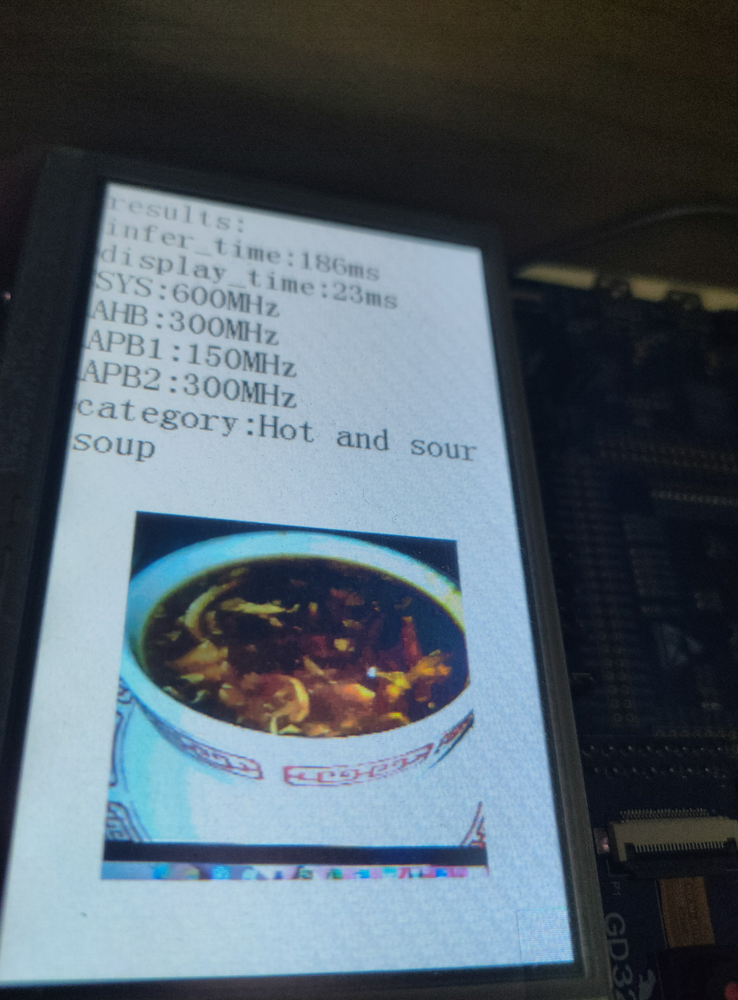

# Training and deployment of the FastVit model

This will provide training for the FastVit model and deployment on GD32 devices

# Preparation

 1. Use git to clone the gd32ai modelzoo project and init submodules.
```
git clone https://github.com/HomiKetalys/gd32ai-modelzoo
git submodule update --init --recursive
```
 2. Add the project root directory to PYTHONPATH and switch to yolo-fastestv2 directory.
 - on powershell.
```
$env:PYTHONPATH=$(pwd)
cd gd32ai-modelzoo/image_classification/ml_fastvit
```

 3. Prepare your dataset.The directory structure of the dataset should be as follows:
```
  dataset
  ├── train
  │   ├── class0
  │   │   ├──img1.jpg
  │   │   └──img2.jpg
  │   └── class1
  │       └──img3.jpg
  │       └──img4.jpg
  └── validation
      ├── class0
      │   ├──img1.txt
      │   └──img2.txt
      └── class1
          └──img3.txt
          └──img4.txt
```
 ## Environmental preparation
 Install the environment(anaconda recommended) according to [ml-fastvit](https://github.com/apple/ml-fastvit/tree/main) , [onnx2tflite](https://github.com/MPolaris/onnx2tflite) .
 # Train
 ## set configuration file
 The configuration file is located in the configs folder in the current directory.Its content looks like the following:
```
workers: 8
data_dir: ../../../datasets/food-101
global_act: ReLU6
batch_size: 512
lr: 0.004
separation: 0
separation_scale: 2
imagenet_trainset_size: '75750'
input_size:
- 3
- 224
- 224
epochs: 200
num_classes: 101
model: fastvit_t4
model_ema: true
```
Modify relevant parameters based on your own dataset and machine configuration
   ## start train
Taking the training model fastvit-t4 on the food-101 dataset as an example, Execute the following command to start training.
```
  python train.py --config configs/food-101.yaml {datasets_root}/food-101
```
  The training results will be saved in results/train.Taking the configuration file food-101.yaml as an example, the first training result will be saved to results/train/{train_name}.
  `train_name` looks like "20240318-110647-fastvit_t4-224"
 # Export And Evaluation
 Next, export the training results of the model as onnx or tflite.Execute the following command to export.
```
  python pytorch2tflite.py --data results/train/{train_name}/food-101.yaml --model_path "results/train/{train_name}/model_best.pth.tar" --convert_type 1 -tflite_val_path "{datasets_root}/food-101/validation"
```
  `convert_type` controls the conversion type,0 for onnx,1 for tflite.If the exported file is of type tflite, it is quantized.
  Meanwhile, the exported model will be evaluated.
  # Deploy
  Next, deploy the exported model to GD32 device
  1. Install STM32CUBE-AI
  The deployment tool used in this project is STM32CUBE-AI. It is based on STM32CUBEIDE. STM32CUBEIDE can be downloaded from [here](https://www.st.com/content/st_com/zh/stm32cubeide.html) .Then install STM32CUBE-AI 8.0.1 in STM32CUBEIDE.
  2. Install keil5 5.29,you can download it from [here](https://www.keil.com/update/rvmdk.asp)
  3. Download gcc-arm-none-eabi 10.3-2021.10 from [here](https://developer.arm.com/downloads/-/gnu-rm) 
  4. Download GD32H7xx AddOn from [here](https://www.gd32mcu.com/cn/download?kw=GD32H7) and install pack.
  5. Execute the following command to generate codes.
```
  python deploy.py --config results/train/{train_name}/food-101.yaml --model_path "results/train/{train_name}/model_best.pth.tar" --convert_type 1 --tflite_val_path "{datasets_root}/food-101/validation" --gd32_project_path deployment/gd32h759IMK6_GCC --series h7 --compiler 1
```
5.  Open "deployment/gd32h759IMK6_GCC/MDK-ARM/GD32H759I_EVAL.uvprojx" with keil5 and configure gcc path in Keil5
6.  Compile and download code to flash memory。
# Metrics
The metrics ultimately exported as quantization model
When nothing is precised in the model name, training is done using transfer learning technique from a pre-trained model. 
Else, "tfs" stands for "training from scratch"."sp" represents the use of spatially separated model deployment
Meanwhile, the table presents the metrics of the model in [stm32ai-modelzoo](https://github.com/STMicroelectronics/stm32ai-modelzoo/blob/main/object_detection/pretrained_models/README.md) .
The metric of the model with an asterisk in its name comes from stm32ai model zoo
## On Food-101 Dataset

| model                  | Implementation | Dataset  | Input Resolution | Top 1 Accuracy (%) | MACCs (M) | Activation RAM (KiB) | Weights Flash (KiB) | STM32Cube.AI version |
|------------------------|----------------|----------|------------------|--------------------|-----------|----------------------|---------------------|----------------------|
| FastVit tfs            | Pytorch        | food-101 | 192x192x3        | 73.29              | 39.89     | 255.32               | 371.82              | 8.0.1                |
| FastVit tfs sp         | Pytorch        | food-101 | 192x192x3        | 73.20              | 39.89     | 73.38                | 397.54              | 8.0.1                |
| FastVit tfs            | Pytorch        | food-101 | 224x224x3        | 75.08              | 54.27     | 335.38               | 371.82              | 8.0.1                |
| FastVit tfs sp         | Pytorch        | food-101 | 224x224x3        | 74.59              | 54.27     | 91.62                | 397.54              | 8.0.1                |
| FastVit tfs sp         | Pytorch        | food-101 | 128x128x3        | 67.58              | 17.76     | 51.96                | 397.54              | 8.0.1                |
| MobileNet v1 0.25 tfs* | TensorFlow     | food-101 | 224x224x3        | 71.33              | 41.10     | 202.33               | 223.32              | 8.1.0                |
| MobileNet v1 0.5 tfs*  | TensorFlow     | food-101 | 224x224x3        | 76.37              | 149.37    | 404.66               | 860.99              | 8.1.0                |
| MobileNet v2 0.35 tfs* | TensorFlow     | food-101 | 224x224x3        | 72.05              | 58.59     | 686.50               | 527.24              | 8.1.0                |
| MobileNet v2 0.35 tfs* | TensorFlow     | food-101 | 128x128x3        | 61.31              | 19.224    | 225.17               | 527.24              | 8.1.0                |

# Results On GD32 Device
## Time
| Model              | Format | Resolution | Board            | Execution Engine | Frequency | Inference time (ms) | STM32Cube.AI version |
|--------------------|--------|------------|------------------|------------------|-----------|---------------------|----------------------|
| FastVit            | Int8   | 192x192x3  | GD32H759IMK6     | 1 CPU            | 600 MHz   | 177 ms              | 8.0.1                |
| FastVit sp         | Int8   | 192x192x3  | GD32H759IMK6     | 1 CPU            | 600 MHz   | 186 ms              | 8.0.1                |
| FastVit            | Int8   | 224x224x3  | GD32H759IMK6     | 1 CPU            | 600 MHz   | 236 ms              | 8.0.1                |
| FastVit sp         | Int8   | 224x224x3  | GD32H759IMK6     | 1 CPU            | 600 MHz   | 245 ms              | 8.0.1                |
| MobileNet v1 0.25* | Int8   | 224x224x3  | STM32H747I-DISCO | 1 CPU            | 400 MHz   | 181 ms              | 8.1.0                |
| MobileNet v2 0.35* | Int8   | 224x224x3  | STM32H747I-DISCO | 1 CPU            | 400 MHz   | 363 ms              | 8.1.0                |
| MobileNet v1 0.5 * | Int8   | 224x224x3  | STM32H747I-DISCO | 1 CPU            | 400 MHz   | 525 ms              | 8.1.0                |

## Images



