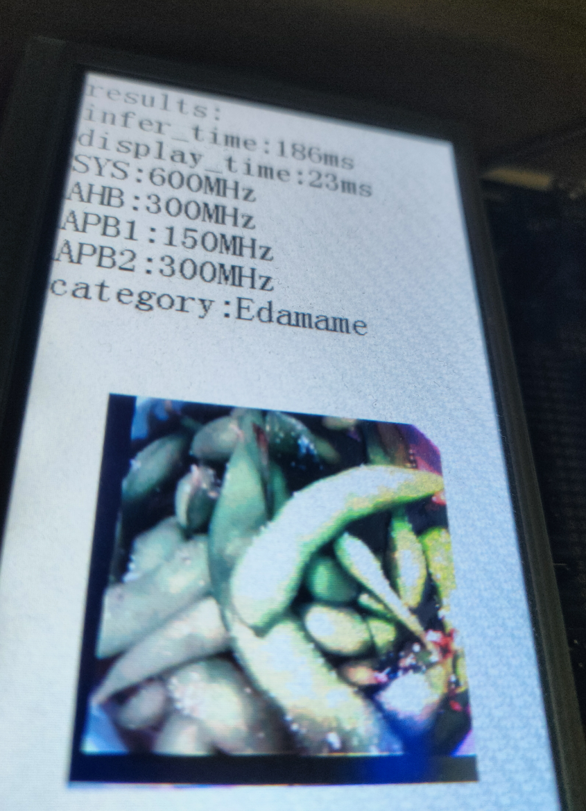

# FastVit的训练与部署

<div align="center">

[中文](README.md) | [English](README_eng.md)

</div>

这里将提供FastVit的训练与部署

# 准备

 1. 使用git克隆gd32ai-modelzoo并初始化附属模块.
```
git clone https://github.com/HomiKetalys/gd32ai-modelzoo
cd gd32ai-modelzoo
git submodule update --init --recursive
```
 2. 将项目根目录添加到PYTHONPATH并切换到ml_fastvit文件夹中.
- 在powershell中
```
$env:PYTHONPATH=$(pwd)
cd object_detection/ml_fastvit
```

 3. 准备好你的数据集，其结构应该如下:
```
  dataset
  ├── train
  │   ├── class0
  │   │   ├──img1.jpg
  │   │   └──img2.jpg
  │   └── class1
  │       └──img3.jpg
  │       └──img4.jpg
  └── validation
      ├── class0
      │   ├──img1.txt
      │   └──img2.txt
      └── class1
          └──img3.txt
          └──img4.txt
```
## Anaconda 环境准备
 根据 [ml-fastvit](https://github.com/apple/ml-fastvit/tree/main) , [onnx2tflite](https://github.com/MPolaris/onnx2tflite) 中的Readme进行环境的安装.
# 训练
## 确认配置文件
配置文件.yaml在当前目录中的configs文件夹中，其内容如下:
```
workers: 8
data_dir: ../../../datasets/food-101
global_act: ReLU6
batch_size: 512
lr: 0.004
separation: 0
separation_scale: 2
imagenet_trainset_size: '75750'
input_size:
- 3
- 224
- 224
epochs: 200
num_classes: 101
model: fastvit_t4
model_ema: true
```
根据你自己的数据集和机器配置修改相关内容
## 开始训练
以在food-101数据集上训练FastVit-t4为例，执行以下命令。
```
  python train.py --config configs/food-101.yaml {datasets_root}/food-101
```
训练结果将会被保存到results/train。以配置文件food-101.yaml为例，第一次的训练结果将会被保存为results/train/{train_name}。`train_name`为"20240318-110647-fastvit_t4-224"。
 # 模型导出与验证
接下来把模型导出为onnx或tflite。执行以下命令进行导出。如果你需要进行部署，可以跳过这一步，部署过程会顺便导出模型。
```
  python export.py --config results/train/{train_name}/food-101.yaml --weight "results/train/{train_name}/model_best.pth.tar" --convert_type 1 -tflite_val_path "{datasets_root}/food-101/validation"
```
`convert_type` 控制导出类型，0表示onnx，1表示tflite。如果导出的模型类型为tflite，则会自动进行量化。同时导出的模型会在指定的配置文件中提供的数据集上进行验证。
# 模型部署
接下来将导出的模型转换成C语言代码，或进一步，部署到具体的芯片上。以“deployment/GD32H759I_EVAL_GCC/MDK-ARM/GD32H759I_EVAL.uvprojx”为例。
1. 下载[X-CUBE-AI](https://www.st.com/en/embedded-software/x-cube-ai.html#st-get-software) 并解压。根据下表选择你需要的版本。若需要的版本小于9.0.0，则需要预先安装[STM32CUBEIDE](https://www.st.com.cn/content/st_com/zh/stm32cubeide.html#st-get-software) ，并在STM32CUBEIDE中安装对应版本的X-CUBE-AI，然后根据[issue](https://github.com/HomiKetalys/gd32ai-modelzoo/issues/2#issuecomment-2143376547) 中的提示复制文件。

2. 安装[keil5](https://www.keil.com/update/rvmdk.asp) 5.29。
3. 下载[gcc-arm-none-eabi](https://developer.arm.com/downloads/-/gnu-rm) 10.3-2021.10并解压，如果使用ARMCC则不需要。 
4. 如果你要在GD32H7设备上部署，下载[GD32H7xx AddOn](https://www.gd32mcu.com/cn/download?kw=GD32H7) 并进行安装。
5. 执行以下命令生成模型推理C语言代码，其中各参数修改为你需要的参数，参数`--c_project_path`如果为文件夹路径，则会在该文件夹下生成Edge_AI文件夹，如果是keil5的.uvprojx文件，则会直接部署到对应的keil5工程中。
```
  python deploy.py --config results/train/{train_name}/food-101.yaml --weight "results/train/{train_name}/model_best.pth.tar" --convert_type 1 --tflite_val_path "{datasets_root}/food-101/validation" --c_project_path ../../modelzoo/deployment/GD32H759I_EVAL_GCC/MDK-ARM/GD32H759I_EVAL.uvprojx --series h7 --stm32cubeai_path ”{X-CUBE-AI PATH}/stedgeai-windows-9.0.0“
```
6. 使用keil5打开"deployment/GD32H759I_EVAL_GCC/MDK-ARM/GD32H759I_EVAL.uvprojx"并在keil5中配置gcc路径，如果是ARMCC则不需要。如果你指定`--c_project_path`为文件夹路径，则还需要在你需要使用该模型的keil5工程中添加对应.c文件，include path以及.a(.lib）库文件，样例工程已完成添加。
7. 在ai_model.h的文件末尾实现你的图像读取方法，对于样例工程，提供了图像读取方法的示例，取消对应的图像读取方法的注释即可。
8. 在你的工程中添加头文件ai_model.h，然后调用AI_Run()来运行模型，调用get_img_cls()获取图像类别。样例工程已写好样例应用。最后编译并烧录。
# 模型指标
指标均是在导出的已量化的tflite模型上测量的。没有角标的模型名称表示是使用了迁移学习在预训练模型上进行训练的。"tfs"表示没有使用预训练。"sp"表示使用了空间分离式模型推理。 同时"*"表示该指标来源于[stm32ai-modelzoo](https://github.com/STMicroelectronics/stm32ai-modelzoo/blob/main/object_detection/pretrained_models/README.md) 。
## Food-101 数据集

| 模型                     | 实现框架       | 输入图像分辨率   | Top 1 Accuracy (%) | MACCs (M) | 激活层RAM占用(KB) | ROM占用 (KB) | 推理框架            |
|------------------------|------------|-----------|--------------------|-----------|--------------|------------|-----------------|
| FastVit tfs            | Pytorch    | 192x192x3 | 73.41              | 39.89     | 255.32       | 371.82     | X-CUBE-AI 8.0.1 |
| FastVit tfs sp         | Pytorch    | 192x192x3 | 73.16              | 39.89     | 73.38        | 397.54     | X-CUBE-AI 8.0.1 |
| FastVit tfs            | Pytorch    | 224x224x3 | 75.13              | 54.27     | 335.38       | 371.82     | X-CUBE-AI 8.0.1 |
| FastVit tfs sp         | Pytorch    | 224x224x3 | 74.84              | 54.27     | 91.62        | 397.54     | X-CUBE-AI 8.0.1 |
| FastVit tfs sp         | Pytorch    | 128x128x3 | 67.24              | 17.76     | 51.96        | 397.54     | X-CUBE-AI 8.0.1 |
| *MobileNet v1 0.25 tfs | TensorFlow | 224x224x3 | 71.13              | 41.09     | 272.96       | 214.69     | X-CUBE-AI 9.1.0 |
| *MobileNet v1 0.5 tfs  | TensorFlow | 224x224x3 | 76.37              | 149.31    | 449.58       | 812.61     | X-CUBE-AI 9.1.0 |
| *MobileNet v2 0.35 tfs | TensorFlow | 224x224x3 | 72.05              | 58.47     | 832.64       | 406.86     | X-CUBE-AI 9.1.0 |
| *MobileNet v2 0.35 tfs | TensorFlow | 128x128x3 | 61.31              | 19.10     | 237.32       | 406.86     | X-CUBE-AI 9.1.0 |

## 运行时间

| 模型                 | 数据格式 | 输入图像分辨率   | 芯片型号       | 芯片类型  | 频率      | 推理时间      | 推理框架            |
|--------------------|------|-----------|------------|-------|---------|-----------|-----------------|
| FastVit sp         | Int8 | 128x128x3 | GD32H759I  | 1 CPU | 600 MHz | 94.14 ms  | X-CUBE-AI 8.0.1 |
| FastVit sp         | Int8 | 128x128x3 | GD32H759I  | 1 CPU | 600 MHz | 86.34 ms  | X-CUBE-AI 9.0.0 |
| FastVit            | Int8 | 192x192x3 | GD32H759I  | 1 CPU | 600 MHz | 179.46 ms | X-CUBE-AI 8.0.1 |
| FastVit            | Int8 | 192x192x3 | GD32H759I  | 1 CPU | 600 MHz | 163.69 ms | X-CUBE-AI 9.0.0 |
| FastVit sp         | Int8 | 192x192x3 | GD32H759I  | 1 CPU | 600 MHz | 186.71 ms | X-CUBE-AI 8.0.1 |
| FastVit sp         | Int8 | 192x192x3 | GD32H759I  | 1 CPU | 600 MHz | 169.33 ms | X-CUBE-AI 9.0.0 |
| FastVit            | Int8 | 224x224x3 | GD32H759I  | 1 CPU | 600 MHz | 237.23 ms | X-CUBE-AI 8.0.1 |
| FastVit            | Int8 | 224x224x3 | GD32H759I  | 1 CPU | 600 MHz | 217.58 ms | X-CUBE-AI 9.0.0 |
| FastVit sp         | Int8 | 224x224x3 | GD32H759I  | 1 CPU | 600 MHz | 246.20 ms | X-CUBE-AI 8.0.1 |
| FastVit sp         | Int8 | 224x224x3 | GD32H759I  | 1 CPU | 600 MHz | 225.09 ms | X-CUBE-AI 9.0.0 |
| *MobileNet v2 0.35 | Int8 | 128x128x3 | STM32H747I | 1 CPU | 400 MHz | 94.34 ms  | X-CUBE-AI 9.1.0 |
| MobileNet v2 0.35  | Int8 | 128x128x3 | GD32H759I  | 1 CPU | 600 MHz | 87.90 ms  | X-CUBE-AI 9.1.0 |
| *MobileNet v1 0.25 | Int8 | 224x224x3 | STM32H747I | 1 CPU | 400 MHz | 163.78 ms | X-CUBE-AI 9.1.0 |
| MobileNet v1 0.25  | Int8 | 224x224x3 | GD32H759I  | 1 CPU | 600 MHz | 122.93 ms | X-CUBE-AI 9.1.0 |
| *MobileNet v2 0.35 | Int8 | 224x224x3 | STM32H747I | 1 CPU | 400 MHz | 290.75 ms | X-CUBE-AI 9.1.0 |
| MobileNet v2 0.35  | Int8 | 224x224x3 | GD32H759I  | 1 CPU | 600 MHz | 216.32 ms | X-CUBE-AI 9.1.0 |
| *MobileNet v1 0.5  | Int8 | 224x224x3 | STM32H747I | 1 CPU | 400 MHz | 485.79 ms | X-CUBE-AI 9.1.0 |
| MobileNet v1 0.5   | Int8 | 224x224x3 | GD32H759I  | 1 CPU | 600 MHz | 347.30 ms | X-CUBE-AI 9.1.0 |


## Images




