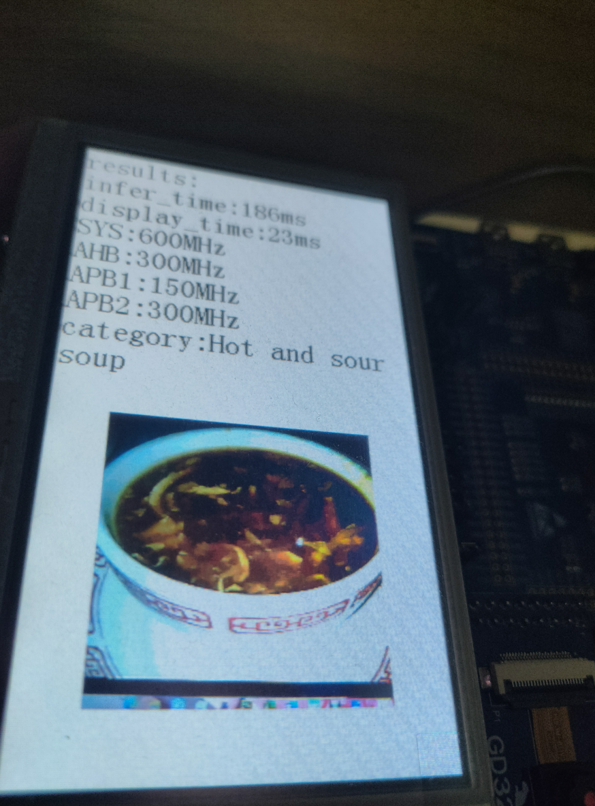
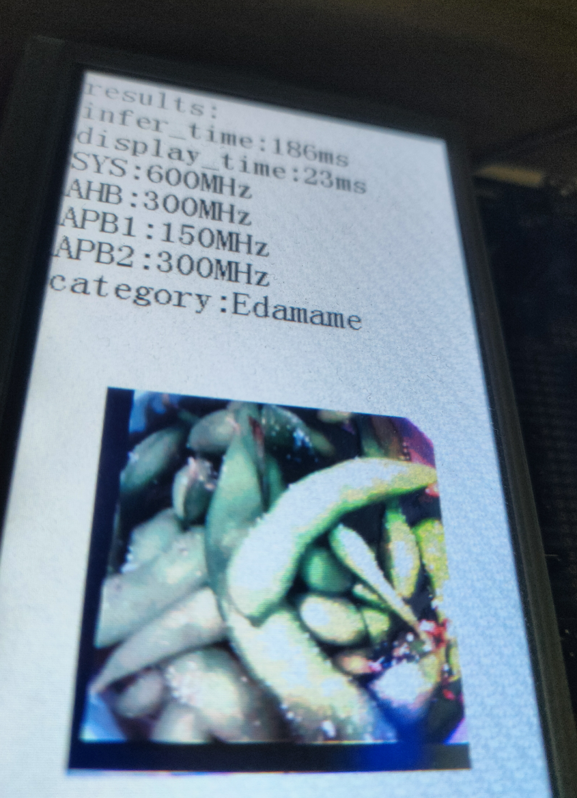

# Training and deployment of the FastVit model

<div align="center">

[中文](README.md) | [English](README_en.md)

</div>

This will provide training for the FastVit model and deployment.

# Preparation

 1. Use git to clone the gd32ai modelzoo project and init submodules.
```
git clone https://github.com/HomiKetalys/gd32ai-modelzoo
cd gd32ai-modelzoo
git submodule update --init --recursive
```
 2. Add the project root directory to PYTHONPATH and switch to ml_fastvit directory.
 - on powershell.
```
$env:PYTHONPATH=$(pwd)
cd object_detection/ml_fastvit
```

 3. Prepare your dataset.The directory structure of the dataset should be as follows:
```
  dataset
  ├── train
  │   ├── class0
  │   │   ├──img1.jpg
  │   │   └──img2.jpg
  │   └── class1
  │       └──img3.jpg
  │       └──img4.jpg
  └── validation
      ├── class0
      │   ├──img1.txt
      │   └──img2.txt
      └── class1
          └──img3.txt
          └──img4.txt
```
 ## Environmental preparation
 Install the environment(anaconda recommended) according to [ml-fastvit](https://github.com/apple/ml-fastvit/tree/main) , [onnx2tflite](https://github.com/MPolaris/onnx2tflite) .
 # Train
 ## set configuration file
 The configuration file is located in the configs folder in the current directory.Its content looks like the following:
```
workers: 8
data_dir: ../../../datasets/food-101
global_act: ReLU6
batch_size: 512
lr: 0.004
separation: 0
separation_scale: 2
imagenet_trainset_size: '75750'
input_size:
- 3
- 224
- 224
epochs: 200
num_classes: 101
model: fastvit_t4
model_ema: true
```
Modify relevant parameters based on your own dataset and machine configuration
   ## start train
Taking the training model fastvit-t4 on the food-101 dataset as an example, Execute the following command to start training.
```
  python train.py --config configs/food-101.yaml {datasets_root}/food-101
```
  The training results will be saved in results/train.Taking the configuration file food-101.yaml as an example, the first training result will be saved to results/train/{train_name}.
  `train_name` looks like "20240318-110647-fastvit_t4-224"
 # Export And Evaluation
 Next, export the training results of the model as onnx or tflite.Execute the following command to export.
```
  python export.py --config results/train/{train_name}/food-101.yaml --weight "results/train/{train_name}/model_best.pth.tar" --convert_type 1 -tflite_val_path "{datasets_root}/food-101/validation"
```
  `convert_type` controls the conversion type,0 for onnx,1 for tflite.If the exported file is of type tflite, it is quantized.
  Meanwhile, the exported model will be evaluated.
  # Deploy
Next, the exported model will be converted into C language code or further deployed on a specific chip.Taking "deployment/GD32H759I2_EVAL_GCC/MDK-ARM/GD32H759I2_EVAL.uvprojx" as an example.
1. Download [X-CUBE-AI](https://www.st.com/en/embedded-software/x-cube-ai.html#st-get-software) and unzip it。Select the version you need based on the table below.If the required version is less than 9.0.0, [STM32CUBEIDE](https://www.st.com.cn/content/st_com/zh/stm32cubeide.html#st-get-software)  needs to be pre installed,And install the corresponding version of X-CUBE-AI in STM32CUBEIDE, then copy the file according to the prompts in [issue](https://github.com/HomiKetalys/gd32ai-modelzoo/issues/2#issuecomment-2143376547) .

2. Install [keil5](https://www.keil.com/update/rvmdk.asp) 5.29。
3. Download [gcc-arm-none-eabi](https://developer.arm.com/downloads/-/gnu-rm) 10.3-2021.10 and unzip it,If using ARMCC, there is no need.
4. If you want to deploy on GD32H7 devices, download [GD32H7xx AddOn](https://www.gd32mcu.com/cn/download?kw=GD32H7)  and install it.
5. Execute the following command to generate model inference C language code, where each parameter is modified to the one you need.If the parameter `--c_project_path` is a folder path, an Edge_AI folder will be generated in that folder. If it is a. uvprojx file from keil5, it will be directly deployed to the corresponding keil5 project.
```
  python deploy.py --config results/train/{train_name}/food-101.yaml --weight "results/train/{train_name}/model_best.pth.tar" --convert_type 1 --tflite_val_path "{datasets_root}/food-101/validation" --c_project_path ../../modelzoo/deployment/GD32H759I_EVAL_GCC/MDK-ARM/GD32H759I_EVAL.uvprojx --series h7 --engine ”{X-CUBE-AI PATH}/stedgeai-windows-9.0.0“
```
6. Use keil5 to open "deployment/GD32H759I2_EVAL_GCC/MDK-ARM/GD32H759I2_EVAL.uvprojx" and configure the gcc path in keil5. If it is ARMCC, it is not necessary. If you specify `--c_project_path` as the folder path, you also need to add the corresponding. c file, include path, and. a (. lib) library file in the keil5 project where you need to use the model. The sample project has been added.
7. Implement your image reading method at the end of the ai_madel. h file. For the sample project, provide an example of the image reading method, and simply remove the corresponding annotation for the image reading method.
8. In your project,add header file ai_model.h and call AI_Run() to run the model, and call get_img_cls() to get the image category. The sample project has been written with sample applications. Finally compile and flash.
# Metrics
The metrics ultimately exported as quantization model
When nothing is precised in the model name, training is done using transfer learning technique from a pre-trained model. 
Else, "tfs" stands for "training from scratch"."sp" represents the use of spatially separated model deployment
Meanwhile, the table presents the metrics of the model in [stm32ai-modelzoo](https://github.com/STMicroelectronics/stm32ai-modelzoo/blob/main/image_classification/pretrained_models/README.md) .
The metric of the model with an asterisk in its name comes from stm32ai model zoo
## On Food-101 Dataset

| model                  | Implementation   | Input Resolution   | Top 1 Accuracy (%)  | MACCs (M)  | Activation RAM (KiB)   | Weights Flash (KiB)   | Inference Framework  |
|------------------------|------------------|--------------------|---------------------|------------|------------------------|-----------------------|----------------------|
| FastVit tfs            | Pytorch          | 192x192x3          | 73.41               | 39.89      | 255.32                 | 371.82                | X-CUBE-AI 8.0.1      |
| FastVit tfs sp         | Pytorch          | 192x192x3          | 73.16               | 39.89      | 73.38                  | 397.54                | X-CUBE-AI 8.0.1      |
| FastVit tfs            | Pytorch          | 224x224x3          | 75.13               | 54.27      | 335.38                 | 371.82                | X-CUBE-AI 8.0.1      |
| FastVit tfs sp         | Pytorch          | 224x224x3          | 74.84               | 54.27      | 91.62                  | 397.54                | X-CUBE-AI 8.0.1      |
| FastVit tfs sp         | Pytorch          | 128x128x3          | 67.24               | 17.76      | 51.96                  | 397.54                | X-CUBE-AI 8.0.1      |
| *MobileNet v1 0.25 tfs | TensorFlow       | 224x224x3          | 71.13               | 41.09      | 272.96                 | 214.69                | X-CUBE-AI 9.1.0      |
| *MobileNet v1 0.5 tfs  | TensorFlow       | 224x224x3          | 76.37               | 149.31     | 449.58                 | 812.61                | X-CUBE-AI 9.1.0      |
| *MobileNet v2 0.35 tfs | TensorFlow       | 224x224x3          | 72.05               | 58.47      | 832.64                 | 406.86                | X-CUBE-AI 9.1.0      |
| *MobileNet v2 0.35 tfs | TensorFlow       | 128x128x3          | 61.31               | 19.10      | 237.32                 | 406.86                | X-CUBE-AI 9.1.0      |

## Time
| Model              | Format | Resolution | Board      | Execution Engine | Frequency | Inference time | STM32Cube.AI version |
|--------------------|--------|------------|------------|------------------|-----------|----------------|----------------------|
| FastVit sp         | Int8   | 128x128x3  | GD32H759I  | 1 CPU            | 600 MHz   | 94.14 ms       | X-CUBE-AI 8.0.1      |
| FastVit sp         | Int8   | 128x128x3  | GD32H759I  | 1 CPU            | 600 MHz   | 86.34 ms       | X-CUBE-AI 9.0.0      |
| FastVit            | Int8   | 192x192x3  | GD32H759I  | 1 CPU            | 600 MHz   | 179.46 ms      | X-CUBE-AI 8.0.1      |
| FastVit            | Int8   | 192x192x3  | GD32H759I  | 1 CPU            | 600 MHz   | 163.69 ms      | X-CUBE-AI 9.0.0      |
| FastVit sp         | Int8   | 192x192x3  | GD32H759I  | 1 CPU            | 600 MHz   | 186.71 ms      | X-CUBE-AI 8.0.1      |
| FastVit sp         | Int8   | 192x192x3  | GD32H759I  | 1 CPU            | 600 MHz   | 169.33 ms      | X-CUBE-AI 9.0.0      |
| FastVit            | Int8   | 224x224x3  | GD32H759I  | 1 CPU            | 600 MHz   | 237.23 ms      | X-CUBE-AI 8.0.1      |
| FastVit            | Int8   | 224x224x3  | GD32H759I  | 1 CPU            | 600 MHz   | 217.58 ms      | X-CUBE-AI 9.0.0      |
| FastVit sp         | Int8   | 224x224x3  | GD32H759I  | 1 CPU            | 600 MHz   | 246.20 ms      | X-CUBE-AI 8.0.1      |
| FastVit sp         | Int8   | 224x224x3  | GD32H759I  | 1 CPU            | 600 MHz   | 225.09 ms      | X-CUBE-AI 9.0.0      |
| *MobileNet v2 0.35 | Int8   | 128x128x3  | STM32H747I | 1 CPU            | 400 MHz   | 94.34 ms       | X-CUBE-AI 9.1.0      |
| MobileNet v2 0.35  | Int8   | 128x128x3  | GD32H759I  | 1 CPU            | 600 MHz   | 87.90 ms       | X-CUBE-AI 9.1.0      |
| *MobileNet v1 0.25 | Int8   | 224x224x3  | STM32H747I | 1 CPU            | 400 MHz   | 163.78 ms      | X-CUBE-AI 9.1.0      |
| MobileNet v1 0.25  | Int8   | 224x224x3  | GD32H759I  | 1 CPU            | 600 MHz   | 122.93 ms      | X-CUBE-AI 9.1.0      |
| *MobileNet v2 0.35 | Int8   | 224x224x3  | STM32H747I | 1 CPU            | 400 MHz   | 290.75 ms      | X-CUBE-AI 9.1.0      |
| MobileNet v2 0.35  | Int8   | 224x224x3  | GD32H759I  | 1 CPU            | 600 MHz   | 216.32 ms      | X-CUBE-AI 9.1.0      |
| *MobileNet v1 0.5  | Int8   | 224x224x3  | STM32H747I | 1 CPU            | 400 MHz   | 485.79 ms      | X-CUBE-AI 9.1.0      |
| MobileNet v1 0.5   | Int8   | 224x224x3  | GD32H759I  | 1 CPU            | 600 MHz   | 347.30 ms      | X-CUBE-AI 9.1.0      |

## Images




