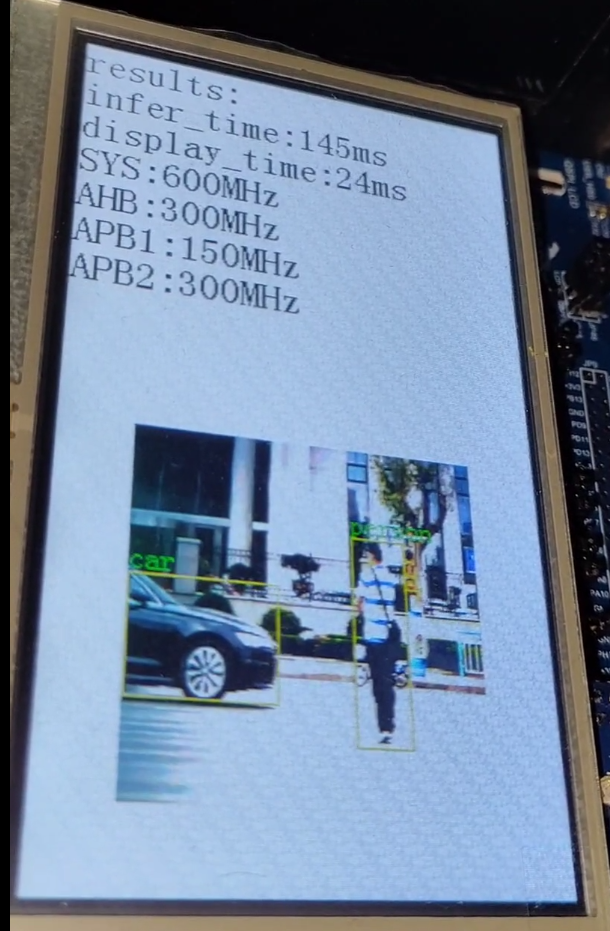

# Yolo-FastestV2模型的训练与部署

<div align="center">

[中文](README.md) | [English](README_eng.md)

</div>

这里将提供Yolo-FastestV2模型的训练与部署步骤。

# 准备

 1. 使用git克隆gd32ai-modelzoo并初始化附属模块.
```
git clone https://github.com/HomiKetalys/gd32ai-modelzoo
cd gd32ai-modelzoo
git submodule update --init --recursive
```

 2. 将项目根目录添加到PYTHONPATH并切换到yolo-fastestv2文件夹中.
- 在powershell中
```
$env:PYTHONPATH=$(pwd)
cd object_detection/yolo_fastestv2
```

 3. 准备好你的数据集，其结构应该如下:
```
  dataset_name
  ├── images
  │   ├── title1
  │   │   ├──img1.jpg
  │   │   └──img2.jpg
  │   └── title2
  │       └──img3.jpg
  │       └──img4.jpg
  ├── label0
  │   ├── title1
  │   │   ├──img1.txt
  │   │   └──img2.txt
  │   └── title2
  │       └──img3.txt
  │       └──img4.txt
  └── label1
```
图像和对应标注文件应该有相同结构的路径，对于同一幅图像的不同类型标注，可以用创建label0和label1来分别保存。
标注文件中的内容格式为darknet yolo. 如下:
```
label cx                  cy                  h           w
0     0.7117890625000001  0.05518711018711019 0.035546875 0.07432432432432433
13    0.21646875000000004 0.25730769230769235 0.1015625   0.10280665280665281
```
 4. 将要用于训练的图像路径保存到train_label0.txt, 而用于验证的图像路径保存到val_label0.txt. 如下:
```
images\train2017\000000391895.jpg
images\train2017\000000522418.jpg
images\train2017\000000184613.jpg
```
如果路径是相对路径，则是相对该txt文件的路径。
## Anaconda 环境准备
根据[Yolo-FastestV2](https://github.com/dog-qiuqiu/Yolo-FastestV2) ，[onnx2tflite](https://github.com/MPolaris/onnx2tflite) 中的README安装环境，如果你需要使用FABD数据集，则安装[facelandmarks](https://github.com/midasklr/facelandmarks) 中的环境。
## 测试过的数据集
  
 - COCO2017：如果你想在COCO2017上进行训练，按照以下步骤进行操作。
 1. 下载[COCO2017](https://cocodataset.org/#download) 数据集。目录结构如下：
```
  COCO2017
  ├── images
  │   ├── train2017
  │   │   ├──000000000009.jpg
  ...
  │   │   └──000000581929.jpg
  │   └── val2017
  │       ├──000000000139.jpg
  ...
  │       └──000000581781.jpg
  └── annotations
      ├── instances_train2017.json
      └── instances_val2017.json
```
  2. 执行以下命令转换COCO2017数据集.
  
转换训练集
```
python ../../common_utils/coco2yolo.py --images_path "{datasets_root}/COCO2017/images/train2017" --json_file "{datasets_root}/COCO2017/annotations/instances_train2017.json" --ana_txt_save_path "{datasets_root}/COCO2017/coco_80/train2017" --out_txt_path "{datasets_root}/COCO2017/train2017.txt"
```
转换验证集

```
python ../../common_utils/coco2yolo.py --images_path "{datasets_root}/COCO2017/images/val2017" --json_file "{datasets_root}/COCO2017/annotations/instances_val2017.json" --ana_txt_save_path "{datasets_root}/COCO2017/coco_80/val2017" --out_txt_path "{datasets_root}/COCO2017/val2017.txt"
```
- 异常驾驶行为数据集(FABD):
1. 下载[HaGrid](https://github.com/hukenovs/hagrid/tree/Hagrid_v1) 数据集。目录结构如下：
```
  HaGrid
  ├── images
  │   ├── call
  │   │   ├──000bc28d-49ee-4c08-a972-368e6fc7eeac.jpg
  ...
  │   │   └──fff9d99d-787b-47f7-a6c0-a1b6cad02063.jpg
  │   └── two_up_inverted
  │       ├──000b4a0d-fd66-4903-8645-5ad4396bd2b9.jpg
  ...
  │       └──ffd643cb-70d6-4d5a-bdd3-ada0aeb6d626.jpg
  └── ann
      ├── call.json
  ...
      └── two_up_inverted.json
```
 2. 下载[WFLW](https://wywu.github.io/projects/LAB/WFLW.html) 数据集。目录结构如下：
```
  WFLW
  ├── images
  │   ├── 0--Parade
  │   │   ├──0_Parade_marchingband_1_116.jpg
  ...
  │   │   └──0_Parade_Parade_0_1040.jpg
  │   └── 61--Street_Battle
  │       ├──61_Street_Battle_streetfight_61_10.jpg
  ...
  │       └──61_Street_Battle_streetfight_61_1008.jpg
  └── list_98pt_rect_attr_train_test
```
  3. 下载[Lapa](https://github.com/jd-opensource/lapa-dataset) 数据集。目录结构如下：
```
  Lapa
  ├── train
  │   ├── images
  │   ├── landmarks
  │   └── labels
  ├── val
  └── test
```
  4. 执行以下命令生成融合的异常行为驾驶数据集：
```
python ../../common_utils/gen_datas.py --wflw_path "{datasets_root}/WFLW" --lapa_path "{datasets_root}/Lapa" --hagrid_path=""{datasets_root}/HaGrid" --save_path "{datasets_root}/FABD"
```
# 训练
## 确认配置文件
配置文件.data在当前目录中的configs文件夹中，其内容如下:
```
[name]  
model_name=coco  
  
[train-configure]  
epochs=300  
steps=150,250  
batch_size=128  
subdivisions=1  
learning_rate=0.001  
  
[model-configure]  
pre_weights=None  
classes=80  
width=256  
height=256  
anchor_num=3  
separation=4  
separation_scale=2  
conf_thr=0.001  
nms_thr=0.5  
iou_thr=0.4  
anchors=9.192727272727273, 14.101818181818182, 27.54909090909091, 37.44, 40.516363636363636, 100.58909090909091, 92.29818181818182, 56.89454545454546, 95.68727272727273, 156.03636363636363, 203.57818181818183, 188.26909090909092  
  
[data-configure]  
label_flag=coco_80  
train=../../../datasets/coco2017/train2017.txt  
val=../../../datasets/coco2017/val2017.txt  
names=./configs/coco.names
```
1. 由于Yolo-FastestV2是anchor based， 所以它需要预先收集anchor信息。执行以下目录为指定数据集收集anchor信息，比如COCO2017。
```
python genanchors.py --traintxt "{datasets_root}/COCO2017/train2017.txt" --output_dir "./" --label_flag "coco_80" --num_clusters 6 --input_width 256 --input_height 256
```
该命令将会在指定目录"./"下生成anchor6.txt。从anchor6.txt中复制第一行到配置文件中的anchors中。

2. 对其余配置参数进行配置，比较关键是是数据集路径的设置和标签名称文件的设置。

## 开始训练
执行以下命令开始训练。将--data参数修改为你自己的配置文件。
```
python train.py --config configs/coco_sp.data
```
训练结果将会被保存到results/train。以配置文件coco_sp.data为例，第一次训练的结果将会被保存到results/train/coco_sp_0000。
# 模型导出与验证
接下来把模型导出为onnx或tflite。执行以下命令进行导出。如果你需要进行部署，可以跳过这一步，部署过程会顺便导出模型。
```
python export.py --config results/train/coco_sp_0000/coco_sp.data --weight results/train/coco_sp_0000/best.pth --convert_type 1 --tflite_val_path "{datasets_root}/COCO2017/images/val2017"
```
`convert_type` 控制导出类型，0表示onnx，1表示tflite。如果导出的模型类型为tflite，则会自动进行量化。同时导出的模型会在指定的配置文件中提供的数据集上进行验证。
# 模型部署
1. 从下面两种推理引擎中选择一种。
- X-CUBEI-AI：如果你选择使用X-CUBE-AI则需要下载[X-CUBE-AI](https://www.st.com/en/embedded-software/x-cube-ai.html#st-get-software) 并解压。根据下表选择你需要的版本。若需要的版本小于9.0.0，则需要预先安装[STM32CUBEIDE](https://www.st.com.cn/content/st_com/zh/stm32cubeide.html#st-get-software) ，并在STM32CUBEIDE中安装对应版本的X-CUBE-AI，然后根据[issue](https://github.com/HomiKetalys/gd32ai-modelzoo/issues/2#issuecomment-2143376547) 中的提示复制文件。

- TinyEngine：如果你选择使用TinyEngine，则不需要额外操作，这是本项目自带的，但是对于ARMCC，只支持AC6。

2. 安装[keil5](https://www.keil.com/update/rvmdk.asp) 5.29。
3. 下载[gcc-arm-none-eabi](https://developer.arm.com/downloads/-/gnu-rm) 10.3-2021.10并解压，如果使用ARMCC则不需要。 
4. 本例中要在GD32H7设备上部署，下载[GD32H7xx AddOn](https://www.gd32mcu.com/cn/download?kw=GD32H7) 并进行安装。
5. 执行以下命令生成模型推理C语言代码，其中各参数修改为你需要的参数，参数`--c_project_path`如果为文件夹路径，则会在该文件夹下生成Edge_AI文件夹，如果是keil5的.uvprojx文件，则会直接部署到对应的keil5工程中。如果你使用TinyEngine，则不需要传入`--stm32cubeai_path`。
```
python deploy.py --config results/train/coco_sp_0000/coco_sp.data --weight results/train/coco_sp_0000/best.pth --tflite_val_path "{datasets_root}/COCO2017/images/val2017" --c_project_path ../../modelzoo/deployment/GD32H759I_EVAL_GCC/MDK-ARM/GD32H759I_EVAL.uvprojx --series h7 --stm32cubeai_path ”{X-CUBE-AI PATH}/stedgeai-windows-9.0.0“
```
6. 使用keil5打开"deployment/GD32H759I_EVAL_GCC/MDK-ARM/GD32H759I_EVAL.uvprojx"并在keil5中配置gcc路径，如果是ARMCC则不需要。如果你指定`--c_project_path`为文件夹路径，则还需要在你需要手动复制生成的代码，并在需要使用该模型的keil5工程中添加对应.c文件，include path以及.a(.lib）库文件。如果你使用TinyEngine，则还需要在keil5工程设置CMSIS版本为5.9.0，CMSIS-DSP版本为1.16.2，CMSIS-NN版本为4.1.0。样例工程我已完成配置。
7. 在ai_model.h的文件末尾实现你的图像读取方法，对于样例工程，提供了图像读取方法的示例，取消对应的图像读取方法的注释即可。
8. 在你的工程中调用AI_Run()来运行模型，调用get_obj_num()获取检测目标数量，调用get_obj_name(id)获取第id个目标的类别，调用get_obj_xyxy(id,&x0,&y0,&x1,&y1)获取第id个目标的框。样例工程已写好样例应用。最后编译并烧录。

# 运行图像




