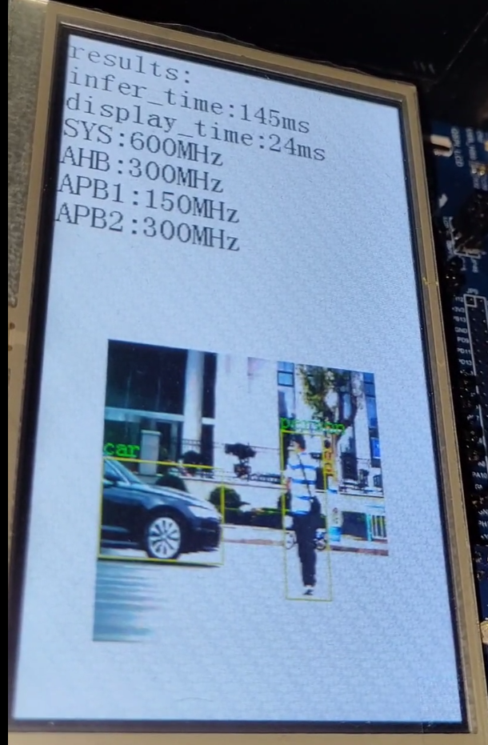
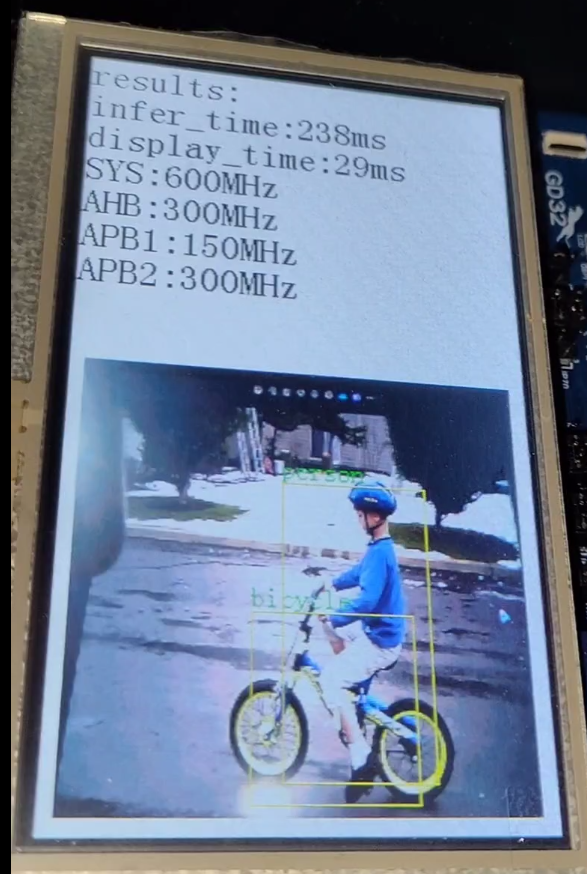

# Training and deployment of the Yolo-FastestV2 model

<div align="center">

[中文](README.md) | [English](README_eng.md)

</div>

This will provide training for the Yolo-FastestV2 model and deployment on GD32 devices

# Preparation

1. Use git to clone the gd32ai modelzoo project and init submodules.
```
git clone https://github.com/HomiKetalys/gd32ai-modelzoo
cd gd32ai-modelzoo
git submodule update --init --recursive
```
2. Add the project root directory to PYTHONPATH and switch to yolo-fastestv2 directory.
 - on powershell.
```
$env:PYTHONPATH=$(pwd)
cd object_detection/yolo_fastestv2
```

3. Prepare your dataset.The directory structure of the dataset should be as follows:
```
  dataset
  ├── images
  │   ├── title1
  │   │   ├──img1.jpg
  │   │   └──img2.jpg
  │   └── title2
  │       └──img3.jpg
  │       └──img4.jpg
  ├── label0
  │   ├── title1
  │   │   ├──img1.txt
  │   │   └──img2.txt
  │   └── title2
  │       └──img3.txt
  │       └──img4.txt
  └── label1
```
The directory path where image files and corresponding annotation files are located should have the same structure, except for the differences between images and label0 or label1.
The annotation format in the annotation file txt is darknet yolo. it looks like:
```
label cx                  cy                  h           w
0     0.7117890625000001  0.05518711018711019 0.035546875 0.07432432432432433
13    0.21646875000000004 0.25730769230769235 0.1015625   0.10280665280665281
```
4. Place the image file used for training in train_label0.txt, and the image file used for validation in val_label0.txt. it looks like:
```
images\train2017\000000391895.jpg
images\train2017\000000522418.jpg
images\train2017\000000184613.jpg
```
If it is a relative path, then it is the relative path relative to the text file.
## Environmental preparation
Install the environment(anaconda recommended) according to [Yolo-FastestV2](https://github.com/dog-qiuqiu/Yolo-FastestV2), [onnx2tflite](https://github.com/MPolaris/onnx2tflite), and [facelandmarks](https://github.com/midasklr/facelandmarks) (If you are using the FABD dataset)
## Supported Datasets
  
 - COCO2017:If you want to train on the COCO2017 dataset, you can prepare the dataset by following the steps below.
 1. Download the COCO2017 dataset from [here](https://cocodataset.org/#download) .The directory structure should be as follows：
```
  COCO2017
  ├── images
  │   ├── train2017
  │   │   ├──000000000009.jpg
  ...
  │   │   └──000000581929.jpg
  │   └── val2017
  │       ├──000000000139.jpg
  ...
  │       └──000000581781.jpg
  └── annotations
      ├── instances_train2017.json
      └── instances_val2017.json
```
  2. Execute the following command to convert the COCO2017 dataset to the required format.
  
 Convert train set
```
python ../../common_utils/coco2yolo.py --images_path "{datasets_root}/COCO2017/images/train2017" --json_file "{datasets_root}/COCO2017/annotations/instances_train2017.json" --ana_txt_save_path "{datasets_root}/COCO2017/coco_80/train2017" --out_txt_path "{datasets_root}/COCO2017/train2017.txt"
```
Convert val set

```
python ../../common_utils/coco2yolo.py --images_path "{datasets_root}/COCO2017/images/val2017" --json_file "{datasets_root}/COCO2017/annotations/instances_val2017.json" --ana_txt_save_path "{datasets_root}/COCO2017/coco_80/val2017" --out_txt_path "{datasets_root}/COCO2017/val2017.txt"
```
- Fusion of Abnormal Behavior Driving Dataset(FABD):
1. Download the HaGrid Test dataset from [here](https://github.com/hukenovs/hagrid/tree/Hagrid_v1) .The directory structure should be as follows：
```
  HaGrid
  ├── images
  │   ├── call
  │   │   ├──000bc28d-49ee-4c08-a972-368e6fc7eeac.jpg
  ...
  │   │   └──fff9d99d-787b-47f7-a6c0-a1b6cad02063.jpg
  │   └── two_up_inverted
  │       ├──000b4a0d-fd66-4903-8645-5ad4396bd2b9.jpg
  ...
  │       └──ffd643cb-70d6-4d5a-bdd3-ada0aeb6d626.jpg
  └── ann
      ├── call.json
  ...
      └── two_up_inverted.json
```
 2. Download the WFLW dataset from [here](https://wywu.github.io/projects/LAB/WFLW.html) .The directory structure should be as follows：
```
  WFLW
  ├── images
  │   ├── 0--Parade
  │   │   ├──0_Parade_marchingband_1_116.jpg
  ...
  │   │   └──0_Parade_Parade_0_1040.jpg
  │   └── 61--Street_Battle
  │       ├──61_Street_Battle_streetfight_61_10.jpg
  ...
  │       └──61_Street_Battle_streetfight_61_1008.jpg
  └── list_98pt_rect_attr_train_test
```
3. Download the Lapa dataset from [here](https://github.com/jd-opensource/lapa-dataset) .The directory structure should be as follows：
```
  Lapa
  ├── train
  │   ├── images
  │   ├── landmarks
  │   └── labels
  ├── val
  └── test
```
  4. Execute the following command to generate a fused FABD dataset:
```
python ../../common_utils/gen_datas.py --wflw_path "{datasets_root}/WFLW" --lapa_path "{datasets_root}/Lapa" --hagrid_path=""{datasets_root}/HaGrid" --save_path "{datasets_root}/FABD"
```
# Train
## set configuration file
The configuration file is located in the configs folder in the current directory.Its content looks like the following:
```
[name]  
model_name=coco  
  
[train-configure]  
epochs=300  
steps=150,250  
batch_size=128  
subdivisions=1  
learning_rate=0.001  
  
[model-configure]  
pre_weights=None  
classes=80  
width=256  
height=256  
anchor_num=3  
separation=4  
separation_scale=2  
conf_thr=0.001  
nms_thr=0.5  
iou_thr=0.4  
anchors=9.192727272727273, 14.101818181818182, 27.54909090909091, 37.44, 40.516363636363636, 100.58909090909091, 92.29818181818182, 56.89454545454546, 95.68727272727273, 156.03636363636363, 203.57818181818183, 188.26909090909092  
  
[data-configure]  
label_flag=coco_80  
train=../../../datasets/coco2017/train2017.txt  
val=../../../datasets/coco2017/val2017.txt  
names=./configs/coco.names
```
1. Due to the fact that the object detection method of Yolo FastV2 belongs to anchor based, it is necessary to cluster the distribution of target boxes first.Execute the following command to collect information on the target box for the specified dataset, such as COCO2017.
```
python genanchors.py --traintxt "{datasets_root}/COCO2017/train2017.txt" --output_dir "./" --label_flag "coco_80" --num_clusters 6 --input_width 256 --input_height 256
```
This command will generate the file anchor6.txt in the specified directory "./".Paste the first line of content from anchor6.txt into anchors in the configuration file.

2. Fill in the remaining content in the configuration file.


## start train
Execute the following command to start training.
```
python train.py --data configs/coco_sp.data
```
The training results will be saved in results/train.Taking the configuration file coco_sp.data as an example, the first training result will be saved to results/train/coco_sp_0000.

# Export And Evaluation
Next, export the training results of the model as onnx or tflite.Execute the following command to export.
```
python pytorch2tflite.py --data results/train/coco_sp_0000/coco_sp.data --model_path results/train/coco_sp_0000/best.pth --convert_type 1 --tflite_val_path "{datasets_root}/COCO2017/images/val2017"
```
`convert_type` controls the conversion type,0 for onnx,1 for tflite.If the exported file is of type tflite, it is quantized. Meanwhile, the exported model will be evaluated.
# Deploy
Next, the exported model will be converted into C language code or further deployed on a specific chip.Taking "deployment/GD32H759I2 EVAL_GCC/MDK-ARM/GD32H759I2 EVAL. uvprojx" as an example.
1. Download [X-CUBE-AI](https://www.st.com/en/embedded-software/x-cube-ai.html#st-get-software) and unzip it。Select the version you need based on the table below.If the required version is less than 9.0.0, [STM32CUBEIDE](https://www.st.com.cn/content/st_com/zh/stm32cubeide.html#st-get-software)  needs to be pre installed,And install the corresponding version of X-CUBE-AI in STM32CUBEIDE, then copy the file according to the prompts in [issue](https://github.com/HomiKetalys/gd32ai-modelzoo/issues/2#issuecomment-2143376547) .


| X-CUBE-AI version | GCC | ARMCC |
|-------------------|-----|-------|
| 8.0.1             | √   | √     |
| 8.1.0             | √   | √     |
| 9.0.0             | √   | ×     |

2. Install [keil5](https://www.keil.com/update/rvmdk.asp) 5.29。
3. Download [gcc-arm-none-eabi](https://developer.arm.com/downloads/-/gnu-rm) 10.3-2021.10 and unzip it,If using ARMCC, there is no need.
4. If you want to deploy on GD32 devices, download [GD32H7xx AddOn](https://www.gd32mcu.com/cn/download?kw=GD32H7)  and install it.
5. Execute the following command to generate model inference C language code, where each parameter is modified to the one you need.If the parameter `--c_project_path` is a folder path, an Edge_AI folder will be generated in that folder. If it is a. uvprojx file from keil5, it will be directly deployed to the corresponding keil5 project.

```
python deploy.py --data results/train/coco_sp_0000/coco_sp.data --model_path results/train/coco_sp_0000/best.pth --tflite_val_path "{datasets_root}/COCO2017/images/val2017" --c_project_path deployment/gd32h759IMK6_GCC --series h7 --stm32cubeai_path ”{X-CUBE-AI PATH}/stedgeai-windows-9.0.0“
```
6. Use keil5 to open "deployment/GD32H759I2_EVAL_GCC/MDK-ARM/GD32H759I2_EVAL.uvprojx" and configure the gcc path in keil5. If it is ARMCC, it is not necessary. If you specify `--c_project_path` as the folder path, you also need to add the corresponding. c file, include path, and. a (. lib) library file in the keil5 project where you need to use the model. The sample project has been added.
7. Implement your image reading method at the end of the ai_madel. h file. For the sample project, provide an example of the image reading method, and simply remove the corresponding annotation for the image reading method.
8. In your project, call AI_Run() to run the model, call get_obj_num() to get the number of detection targets, call get_obj_name(id) to get the category of the idth target, and call get_obj_xyxy(id,&x0,&y0,&x1,&y1) to get the box of the idth target. The sample project has been written with sample applications. Finally compile and flash.

## Images




